<!-- backgroundColor: #FF9500 -->
<!-- color: #36648B-->
# 数据结构和算法 

---

<!-- paginate: true -->
### 1.为什么要学习数据结构和算法？
### 2.什么是算法？
### 3.什么是数据结构？

---
计算机只是一个很冰冷的机器，你给他下发什么样的指令，它就能作出什么样的反应。而开发工程师要做的是如何把实际的问题转化成计算机的指令，如何转化，来看看《数据结构》的经典说法：***设计出数据结构， 在施加以算法就行了。***
所以，很重要的一点，数据结构和算法对建立解决问题的思想非常重要。

---
#### 算法：是如何解决一类问题的明确规范；是一组精确定义操作序列的规则。
#### 我们首先要搞懂时间复杂度和空间复杂度的概念，它们的高低共同决定着一段代码质量的好坏。
1. 时间复杂度：一个算法的时间复杂度反映了程序运行从开始到结束所需的时间。把算法中基本操作重复执行的的次数（频度）作为算法的时间复杂度。
没有循环语句，记作 **O(1)** ，也称为常数阶。只有一重循环，则算法的基本操作的执行频度与问题规模n呈线性增大关系，记作 **O(n)** ，也叫线性阶。
---

常见的时间复杂度有：
+  **O(1)** : Constant Complexity: Constant 常数复杂度
+  **O(logn)** :  Logarithmic Complexity: 对数复杂度
+  **O(n)** : Linear Complexity: 线性时间复杂度
+  **O(n^2)** : N square Complexity 平⽅复杂度
+  **O(n^3)** : N square Complexity 立方复杂度
+  **O(2^n)** : Exponential Growth 指数
+  **O(n!)** :  Factorial 阶乘

---

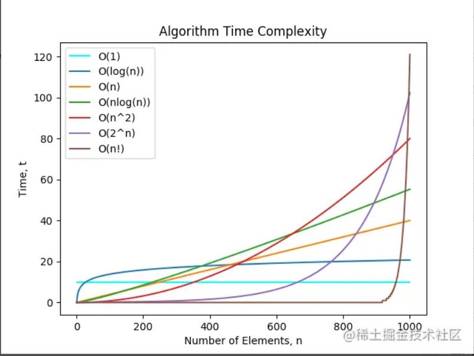

---
1. 空间复杂度：一个程序的空间复杂度是指运行完一个程序所需内存的大小。利用程序的空间复杂度，可以对程序的运行所需要的内存多少有个预先估计。
一个程序执行时除了需要存储空间和存储本身所使用的指令、常数、变量和输入数据外，还需要一些对数据进行操作的工作单元和存储一些为现实计算所需信息的辅助空间。

---
#### 数据结构：简单的来说逻辑结构就是数据之间的关系，逻辑结构大概统一的可以分成两种：线性结构、非线性结构。
* 线性结构：是一个有序数据元素的集合。 其中数据元素之间的关系是一对一的关系，即除了第一个和最后一个数据元素之外，其它数据元素都是首尾相接的。
  
  常用的线性结构有: 栈，队列，链表，线性表。

* 非线性结构：各个数据元素不再保持在一个线性序列中，每个数据元素可能与零个或者多个其他数据元素发生联系。
  
  常见的非线性结构有 二维数组，树等。

---
#### 数据结构分类示意图：
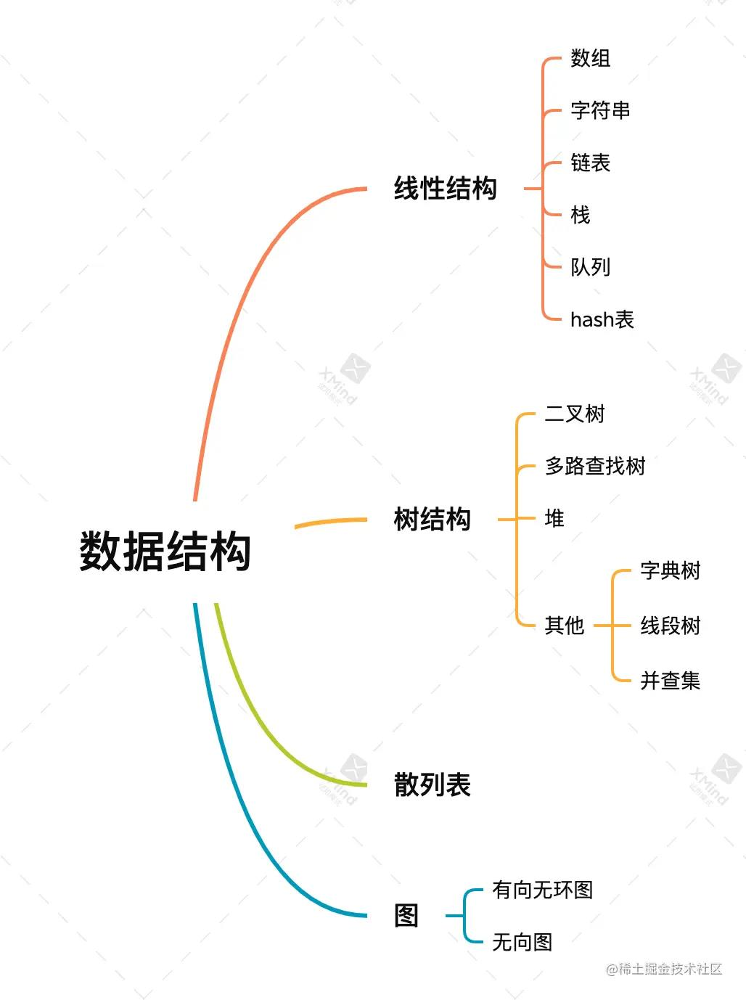

---

栈：栈是一种遵从后进先出（LIFO）原则的有序集合。新添加或待删除的元素都保存在栈的同一端，称作栈顶，另一端就叫栈底。在栈里，新元素都靠近栈顶，旧元素都接近栈底。

栗子：类似于自动餐托盘，最后放上的托盘，往往先被拿出去使用。
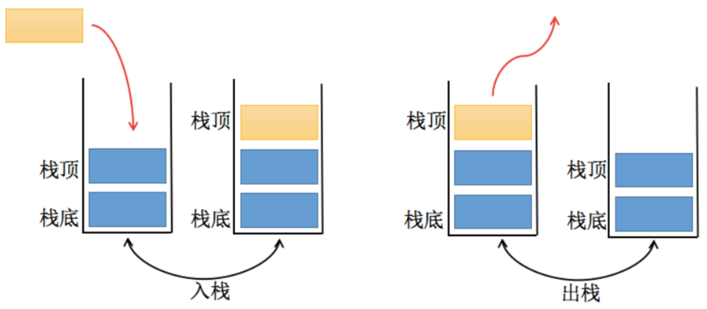

---
#### 代码实现栈结构：
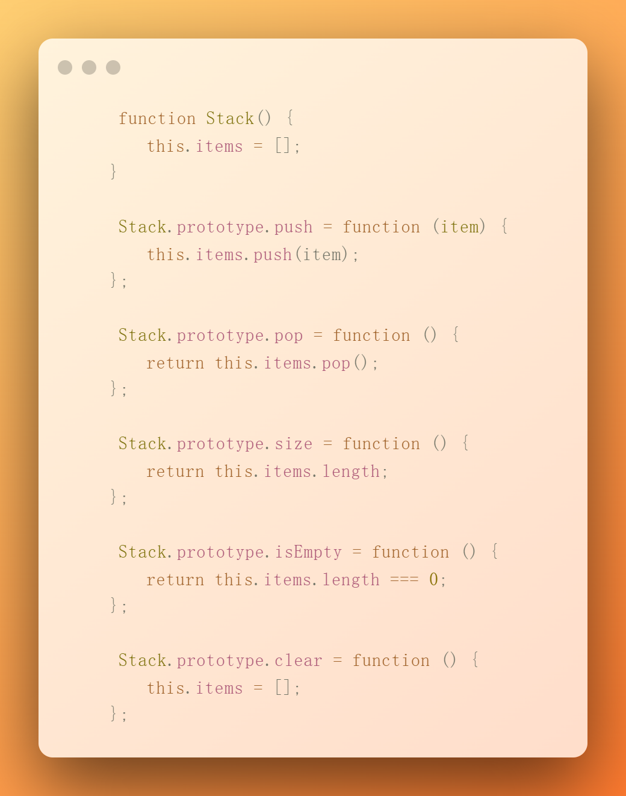

---
#### 应用场景：平衡括号
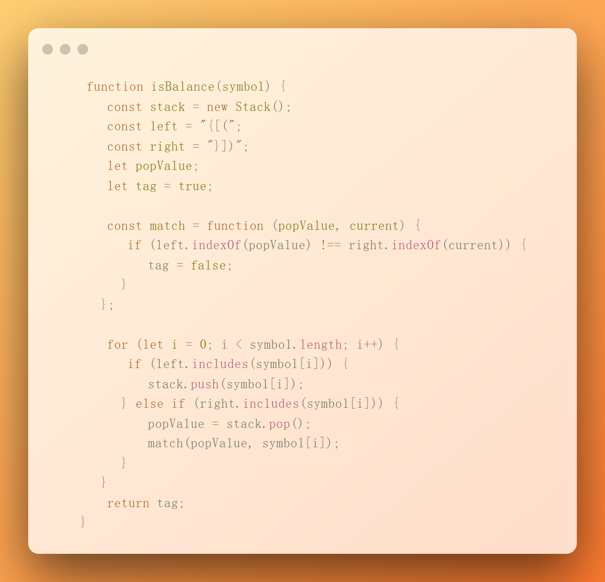

---
队列：队列是遵循先进先出（FIFO，也称为先来先服务）原则的一组有序的项。队列在尾部添加新元素，并从顶部移除元素。最新添加的元素必须排在队列的末尾。

栗子：排队，电影院、商场吃饭、WC。
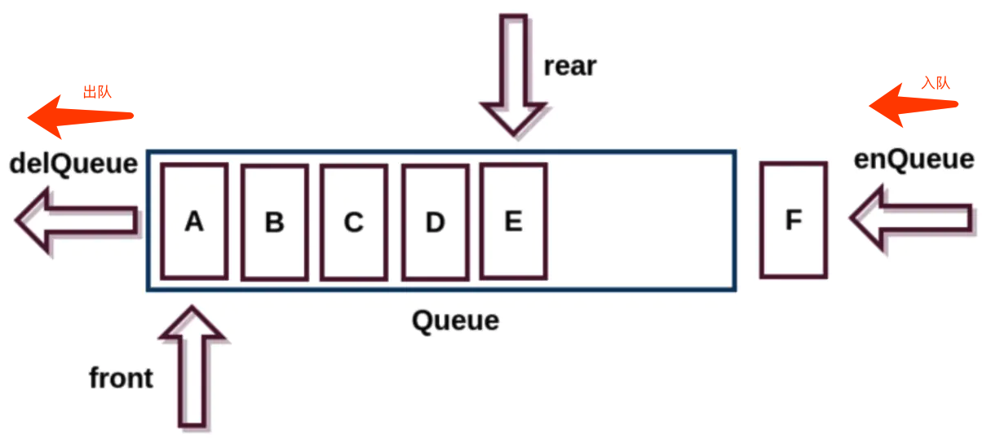

---
#### 代码实现队列结构：
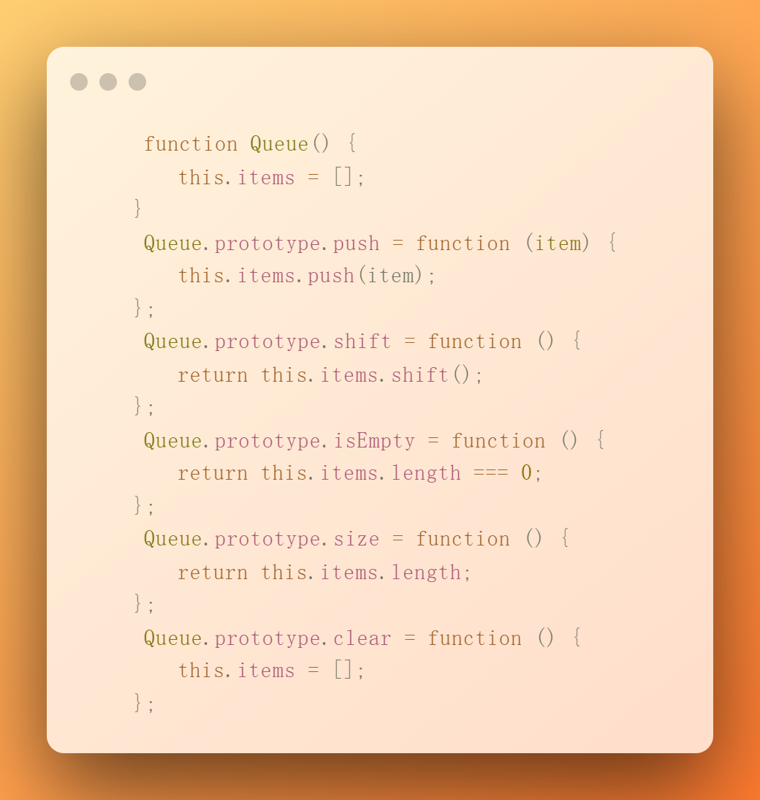

---
#### 应用场景：最小优先队列，比如普通用户上医院需要排队挂号，但是具有 VIP 的用户能'插队'办理业务。
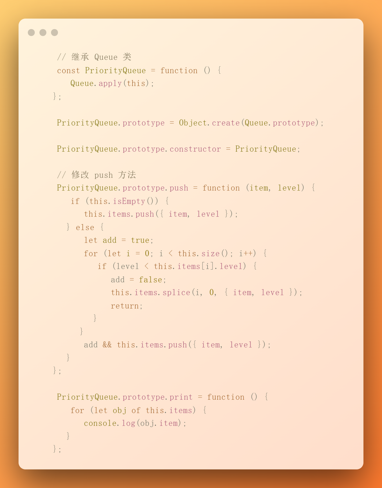

---
链表：链表存储有序的元素集合，但不同于数组，链表中的元素在内存中并不是连续放置的。每个元素有一个存储元素本身的节点和一个指向下一个元素的指针组成。
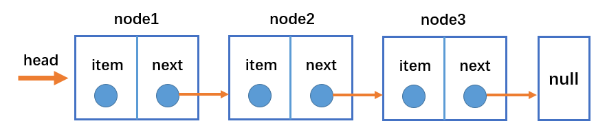

---

#### 代码实现链表结构
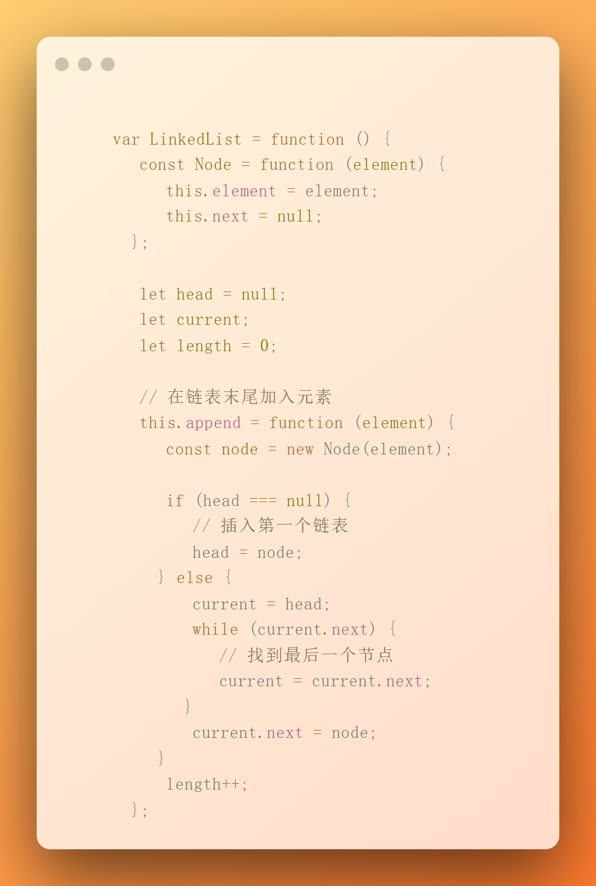

---
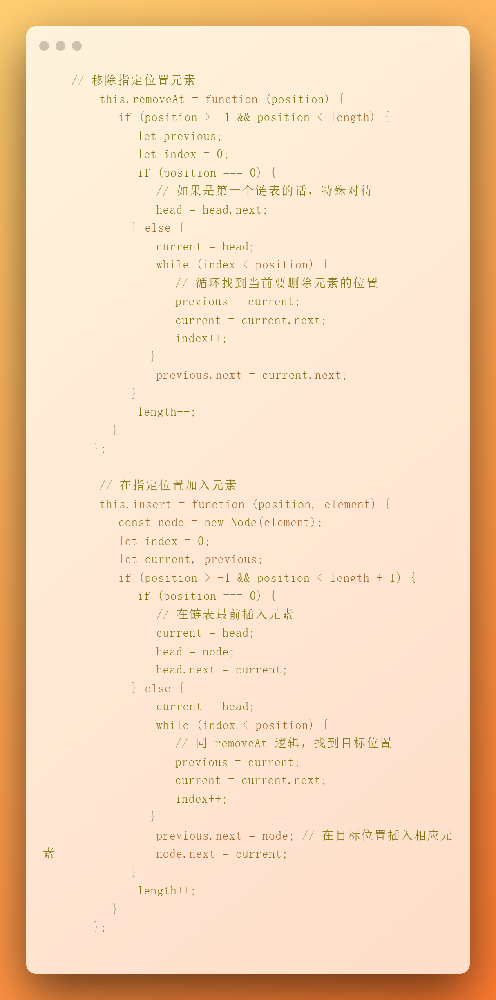

---
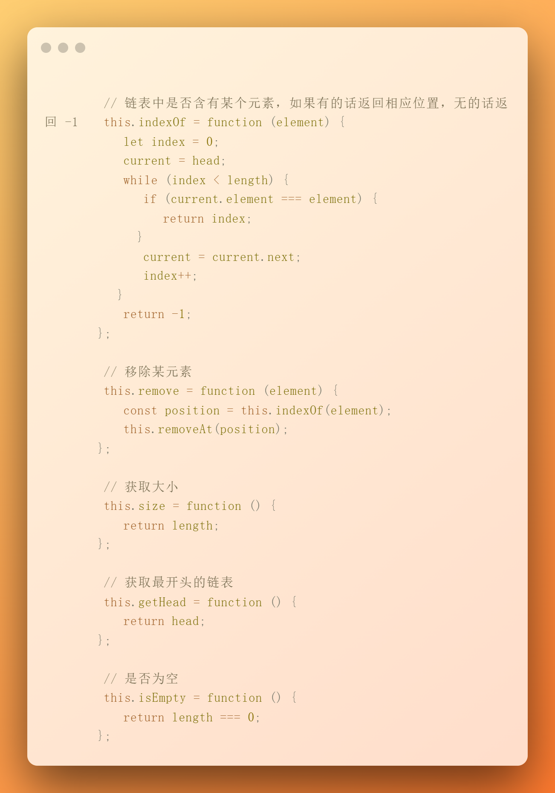

---
#### 测试用例：
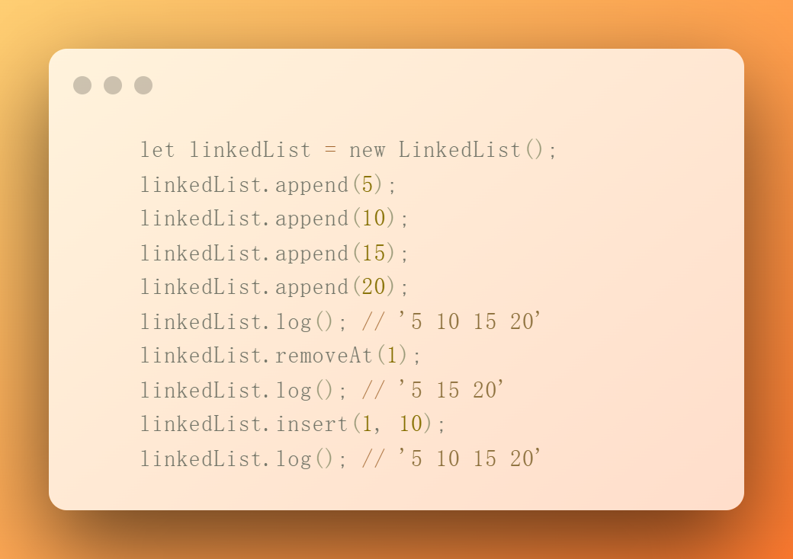

---
集合：集合是由一组无序且唯一（既不能重复）的项组成的。没有顺序意味着不能通过下标值进行访问，不能重复意味着相同的对象在集合中只会存在一份。
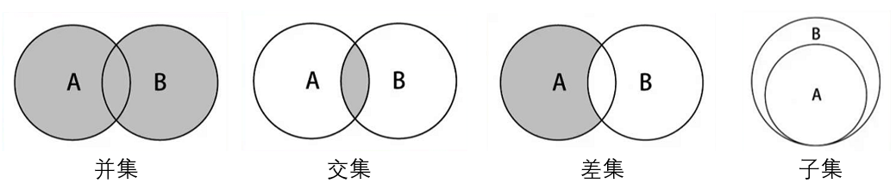

---
#### 代码实现集合结构
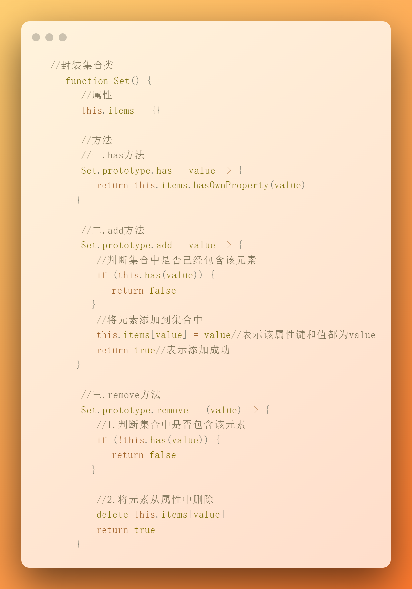

---
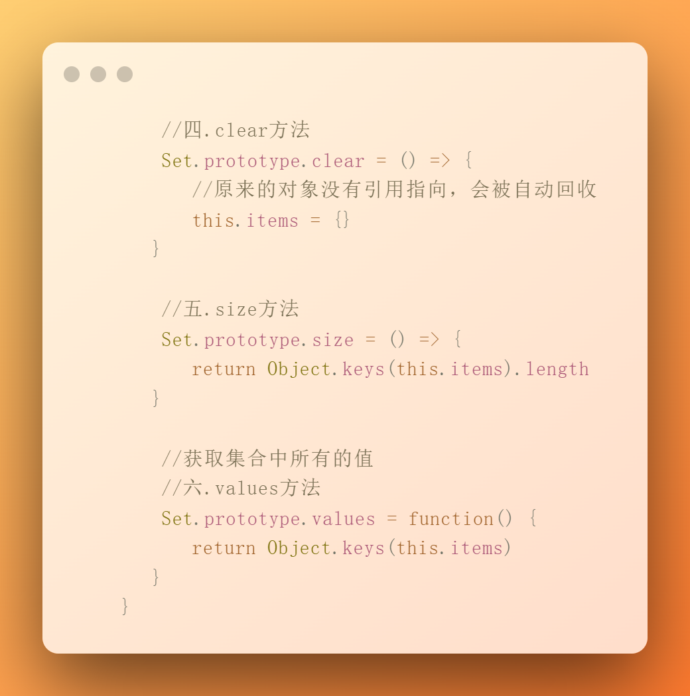

---

TO BE CONTINUE... Thanks